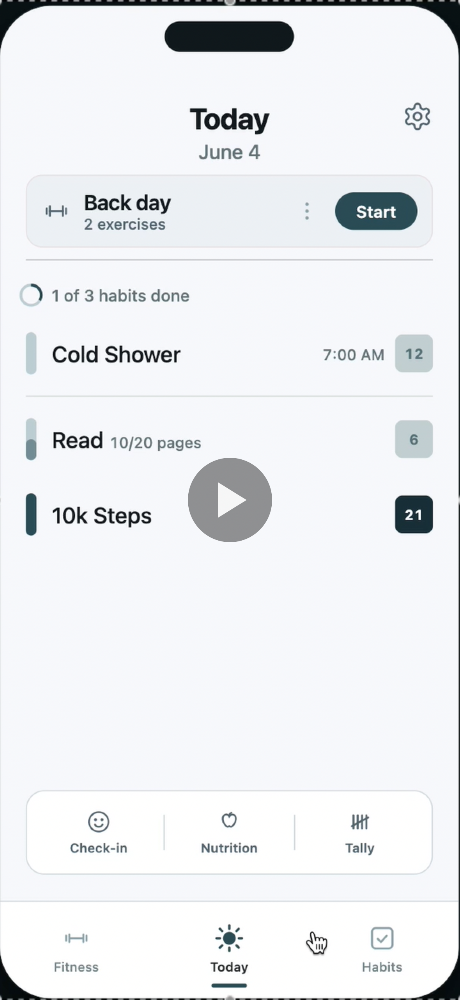
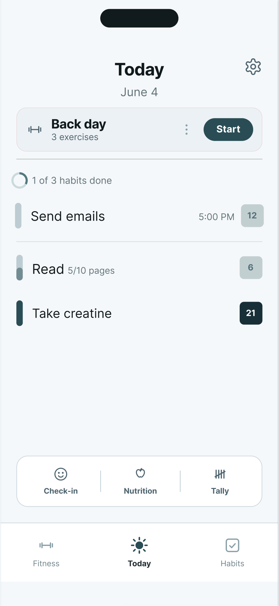
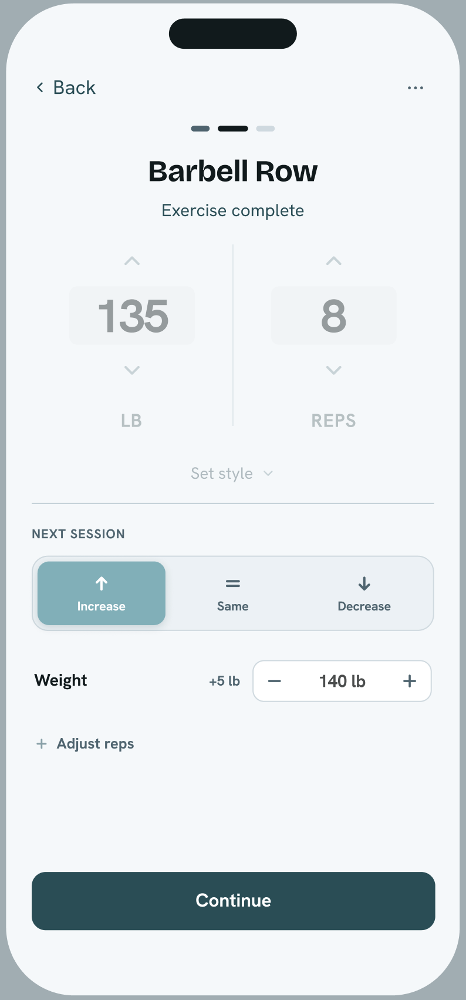
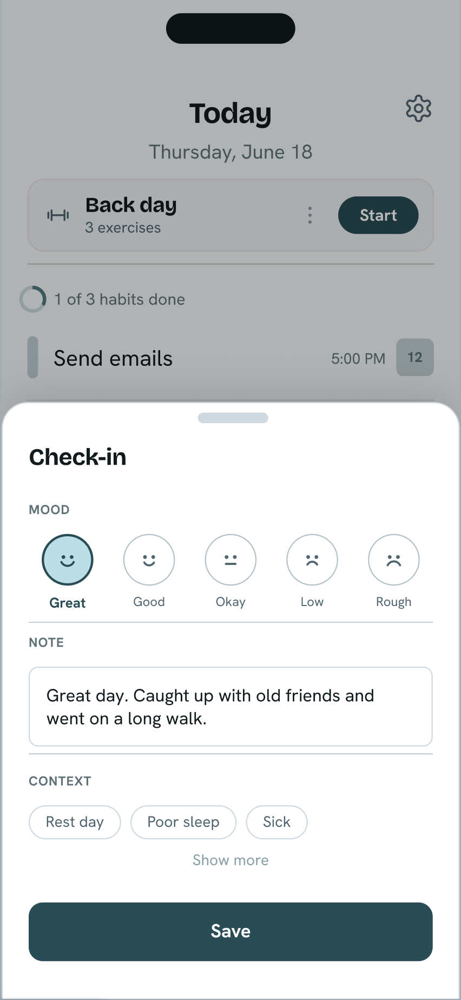

# Cadena

## Overview

Cadena is an in-progress Expo/React Native mobile app for daily habit tracking, fitness planning, and lightweight personal check-ins. It is being built as a local-first product centered on a single Today view.

## Demo / Design

Cadena is currently in active development. The Figma prototype shows the intended product flow, screen structure, and interaction model.

### Links

| Asset | Link |
|---|---|
| Demo video | [Watch demo](https://raw.githubusercontent.com/hnadhem/Cadena/main/docs/demo.mp4) |
| Figma prototype | [View prototype](https://www.figma.com/design/GjeSAk79x2gZBlPbHpy1ZV/habIt?node-id=440-18136&t=FvSVJmJxfxeYcbXJ-1) |

### Demo video

<p align="center">
  <a href="https://raw.githubusercontent.com/hnadhem/Cadena/main/docs/demo.mp4">
    
  </a>
</p>

### Screen previews

<table>
  <tr>
    <td align="center" valign="top" width="33%">
      
      <br />
      <sub>Today</sub>
    </td>
    <td align="center" valign="top" width="33%">
      
      <br />
      <sub>Workout logging</sub>
    </td>
    <td align="center" valign="top" width="33%">
      
      <br />
      <sub>Check-in sheet</sub>
    </td>
  </tr>
</table>

## Core Features

- **Today view:** Central daily screen with fitness activity, habit summary, habit rows, and quick actions.
- **Habit foundation:** Typed habit models, service-backed persistence, and Today habit sorting/completion summary logic.
- **Fitness foundation:** Workout/cardio schema, session store, Today fitness cards, and Skip / Move to Tomorrow actions.
- **Quick actions:** Check-in, Nutrition, and tally bottom sheets currently validate interaction patterns with local state.
- **Navigation scaffold:** Expo Router tabs for Fitness, Today, and Habits, plus placeholder routes for planned feature areas.
- **Local data layer:** SQLite setup and migration runner based on the v13 schema reference.
- **Tests:** Jest coverage for Today selectors, Today service behavior, check-in utilities, tally utilities, and date utilities.

## Product Rationale

- The product prioritizes a Today-centered workflow so daily fitness, habits, and lightweight context are visible without switching tools.
- The app is local-first for now to keep early development focused on core workflows.
- The schema and service layers were built before full UI completion to keep habit, workout, and module flows consistent.
- Optional modules such as nutrition and medication are scaffolded separately from core habit completion to avoid overloading the main routine score.
- Some interactions are intentionally prototype-level while persistence and full editing flows are still being built.

## Tech Stack

| Area | Technology |
| --- | --- |
| Framework | React Native with Expo SDK 54 |
| Navigation | Expo Router |
| Language | TypeScript |
| Local persistence | expo-sqlite |
| State management | Zustand |
| UI | React Native components, shared theme tokens, Ionicons |
| Dates | dayjs |
| Testing | Jest with jest-expo |
| Package manager | npm |

## Current Status

Cadena is under active development and is not complete or release-ready.

Built:

- Expo app scaffold and tab navigation
- SQLite schema/migration setup
- Typed domain models
- Zustand stores for user preferences and workout session state
- Habit flows persist directly through services (`UI -> service -> SQLite`); stores are used only where ephemeral in-memory state exists between start and commit.
- Initial Today screen and supporting service/selectors
- Placeholder screens for planned Fitness, Habits, workout/cardio, settings, nutrition, medication, and tally flows

Still in progress:

- Persisted habit creation, editing, targets, and daily logging
- Workout/cardio start, resume, and history flows
- Schedule generation for planned sessions
- Persisted check-in, tally, nutrition, and medication workflows
- Progress summaries, onboarding, reminders, and final visual polish

## Roadmap

- Complete persisted habit management and logging
- Build workout/cardio session player flows
- Wire schedule generation into Today
- Add progress charts and summaries
- Persist optional module workflows
- Add onboarding and settings
- Add screenshots, final app assets, and release packaging

## Running Locally

Prerequisites:

- Node.js and npm
- Expo-compatible iOS/Android simulator or Expo Go on a device

Install dependencies:

```bash
npm install
```

Start Expo:

```bash
npm start
```

Run a platform target:

```bash
npm run ios
npm run android
npm run web
```

Run checks:

```bash
npm run typecheck
npx jest --watchAll=false
```
